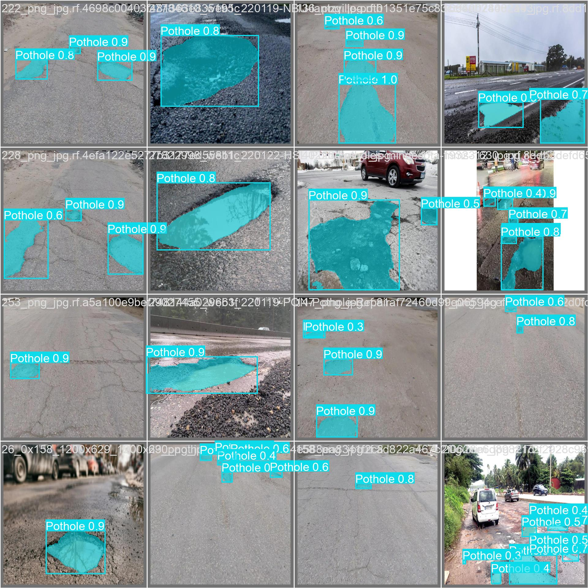

<a id="readme-top"></a>

<br />
<div align="center">
  <h3 align="center">Pothole Detection</h3>

  <p align="center">
    Semantic segmentation of road potholes
    <br />
    <a href="https://github.com/Arnav6508/Pothole-detection-with-semantic-segmentation"><strong>Explore the docs »</strong></a>
    <br />
  </p>
</div>


<!-- TABLE OF CONTENTS -->
<details>
  <summary>Table of Contents</summary>
  <ol>
    <li><a href="#about-the-project">About The Project</a>
    <li><a href="#methodology">Methodology</a></li>
    <li>
      <a href="#getting-started">Getting Started</a>
      <ul>
        <li><a href="#installation">Installation</a></li>
      </ul>
    </li>
    <li><a href="#contributing">Contributing</a></li>
    <li><a href="#references">References</a></li>
    <li><a href="#contact">Contact</a></li>
  </ol>
</details>


<!-- ABOUT THE PROJECT -->
## About The Project

This project focuses on detecting potholes on roads using semantic segmentation, a technique that classifies each pixel of an image into a predefined category. The model identifies potholes with high precision by segmenting them from the road surface in images or video frames. This solution leverages YOLO v11, a state-of-the-art deep learning framework, for semantic segmentation to achieve accurate and efficient real-time detection.
<br>
<h5>Potential Applications:</h5>

- <b>Smart Traffic Management</b>
Integration with traffic management systems to identify and prioritize the repair of potholes in high-traffic areas.

- <b>Autonomous Vehicles</b>
Enhancing autonomous navigation by providing vehicles with real-time road condition data, enabling safer and smoother travel.





## Methodology

Utilized YOLO v11 for semantic segmentation due to its real-time processing capability and high accuracy. The model was trained over 100 epochs.


<!-- GETTING STARTED -->
## Getting Started

There are 2 functions in main.py :

- test_on_image
- test_on_video

Both the functions take path to the image/video respectively to generate output with potholes segmented.


### Installation

_Below is an example of how you can instruct your audience on installing and setting up your app._

1. Clone the repo
   ```sh
   git clone https://github.com/Arnav6508/Pothole-detection-with-semantic-segmentation
   ```

2. Change git remote url to avoid accidental pushes to base project
   ```sh
   git remote set-url origin github_username/repo_name
   git remote -v # confirm the changes
   ```


<!-- CONTRIBUTING -->
## Contributing

Contributions are what make the open source community such an amazing place to learn, inspire, and create. Any contributions you make are **greatly appreciated**.

If you have a suggestion that would make this better, please fork the repo and create a pull request. You can also simply open an issue with the tag "enhancement".
Don't forget to give the project a star! Thanks again!

1. Fork the Project
2. Create your Feature Branch (`git checkout -b feature/AmazingFeature`)
3. Commit your Changes (`git commit -m 'Add some AmazingFeature'`)
4. Push to the Branch (`git push origin feature/AmazingFeature`)
5. Open a Pull Request


<!-- REFERENCES -->
## References

https://universe.roboflow.com/gp-grakz/pothole-segmentation-g6hbh/dataset/14

https://www.kaggle.com/datasets/farzadnekouei/pothole-image-segmentation-dataset

<!-- CONTACT -->
## Contact

Email -  arnavgupta6508@gmail.com

<p align="right">(<a href="#readme-top">back to top</a>)</p>